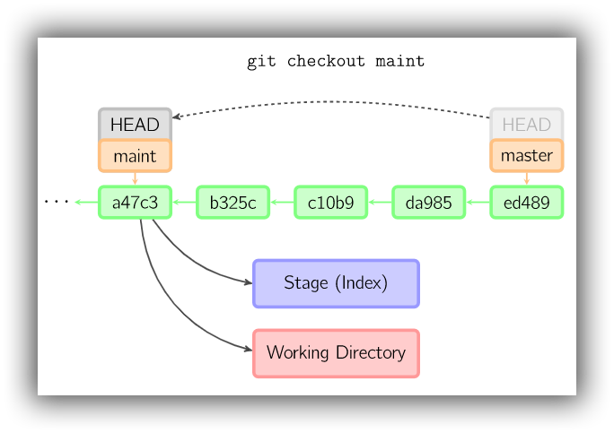
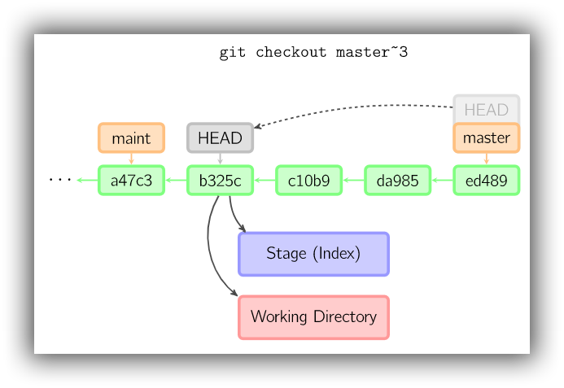
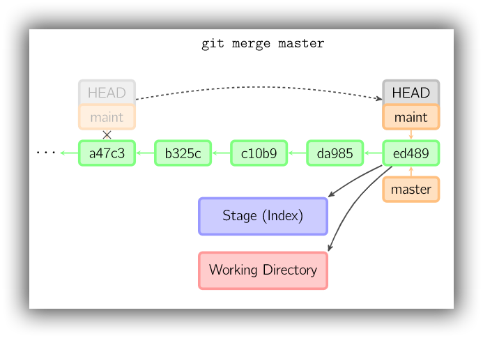
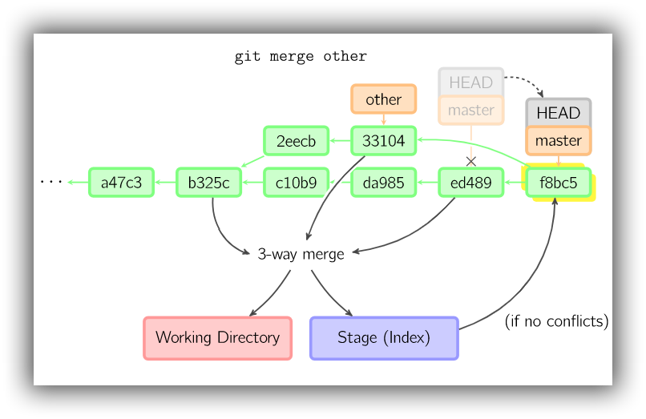

# 分支与合并

[TOC]

## branch

### 创建和删除

```bash
# 新建一个分支，但依然停留在当前分支
$ git branch [branch-name]
# 新建一个分支，指向指定commit
$ git branch [branch] [commit]
# 新建一个分支，并与指定的远程分支建立tracking关系
$ git branch --track [branch] [remote-branch]

# 删除本地分支
$ git branch -d [branch-name]
# 删除未合并的本地分支
$ git branch -D [branch-name]


# 删除保留在本地的remote-tracking分支，
# 对本地分支和跟踪关系没有影响，
# 再次调用fetch或pull后，会重新创建被删除的remote-tracking分支
$ git branch -d -r origin/dev
```

####  push

```bash
# 删除远程分支，会从远程库中直接移除分支
$ git push origin --delete [branch-name]
```

### 设置

```bash
# 设置追踪关系，在远程分支和本地分支间建立追踪关系
# 如果未指定branchname，则默认采用当前分支
$ git branch (--set-upstream-to=<upstream> | -u <upstream>) [<branchname>]
```

### 列出分支

```bash
# 列出所有本地分支
$ git branch
# 列出所有远程分支
$ git branch -r
# 列出所有本地分支和远程分支
$ git branch -a
# 列出所有本地分支， 并且包含更丰富的信息，
# 如每一个分支正在跟踪哪个远程分支与本地分支是否是领先、落后或是都有。
$ git branch -vv
```

## checkout

### 新建并切换分支

```bash
# 新建一个分支，并将HEAD切换到该分支
$ git checkout -b <branch>
# 新建一个分支，指向给定的commit，并将HEAD切换到该分支
$ git checkout -b <branch> [commit]

# 新建一个与远程分支同名的分支，并将HEAD切换到该分支，同时与远程分支建立tracking
$ git checkout --track origin/<branch>
# 新建一个分支，并将HEAD切换到该分支，同时与远程分支建立tracking
$ git checkout -b <local_branch> origin/<branch>

# 创建一个全新的分支，不包含原分支的提交历史，并切换到该分支，
# Gihthub项目主页分支用这个。
git checkout --orphan <new_branch> [<start_point>]
```

### 切换分支

```bash
# 切换HEAD到指定分支，并将暂存区和工作区的内容置换为对应commit的内容
$ git checkout <(local)branch-name>
# 例如下图：git checkout maint
# 执行后，任何存在于a47c3中的文件将被拷贝到暂存区和工作区中
# 任何存在于ed489中，但不存在于a47c3的文件将被删除
# 不会影响两者中均不存在的文件

# 切换HEAD到上一个分支
$ git checkout -
```



### 匿名分支

如果 `checkout` 命令中的参数不是本地 branch，而是 tag、remote branch、SHA-1 ID 或是类似 `master~3` 这样的参数。我们将会得到一个被称作 `detached HEAD` 匿名分支。匿名分支对于在 history 中切换非常有用。如果想要编译名为 version 1.6.6.1 的标签。我们可以执行 `git checkout v1.6.6.1` ，接着便可编译，安装，结束后再切换到另一个分支，比如 `git checkout master` 。但是，当 commit 操作涉及到 `detached HEAD` 时，会有稍许不同。



## merge

```bash
# 合并指定分支到当前分支
$ git merge [branch]
$ git merge [commit]

# 在合并时创建创建一个commit
$ git merge --no-ff -m "message" dev
```

merge 用于合并分支，执行 merge 后通常会新建一个 commit，用于包含目标分支的所有变化。另外在合并之前，必须保证暂存区和当前 commit 一致。如果在合并后存在冲突(conflicts)，则需要手动解决。Git 会在冲突的位置使用 `<<<<<<<` 、`=======` 、`>>>>>>>` 进行标注。必须先手动解决冲突，然后 add 和 commit 后才能完成合并。

合并时，如果另一个 commit 是当前 commit 的祖父节点，那么什么也不会做。
如果当前 commit 是另一个 commit 的祖父节点，便会采用 *fast-forward* 合并，此时不会生成新的 commit，仅会将所在分支指向另一个 commit。具体如下：




除了以上两种情况外，在其余情况下会均采用"real"合并。"real" 合并默认执行"recursive"合并，但也可以选择其它合并策略。"recursive"合并会对当前 commit(ed489)、目标commit (33104)以及两者的共有的祖父节点(b325c)执行 [three-way merge](http://en.wikipedia.org/wiki/Three-way_merge) 。合并结果会保存到工作区和暂存区，然后新生成一个 commit(f8bc5)。f8bc5 拥有两个父节点。具体如下：



## tag

标签按字母顺序排列，而非按设置标签的时间顺序。

```bash
# 列出所有tag
$ git tag
# 查看tag信息
$ git show [tag]

# 新建一个tag在当前commit
$ git tag [tag]
# 新建一个tag在指定commit
$ git tag [tag] [commit]
# 新建一个tag在指定commit，带说明
$ git tag -a v0.1 -m "message" [commit]
# 新建一个tag在指定commit，并用私匙签名。签名采用PGP(GnuPG)签名
$ git tag -s v0.2 -m "message" [commit]

# 新建一个分支，指向某个tag
$ git checkout -b [branch] [tag]

# 删除本地tag
$ git tag -d [tag]
# 删除远程tag (需要先从本地删除)
$ git push origin :refs/tags/[tagName]

# 提交指定tag到远程仓库
$ git push [remote] [tag]
# 提交所有tag
$ git push [remote] --tags
```

