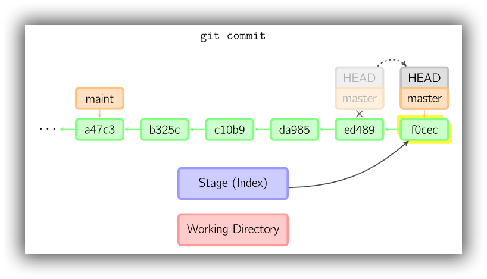
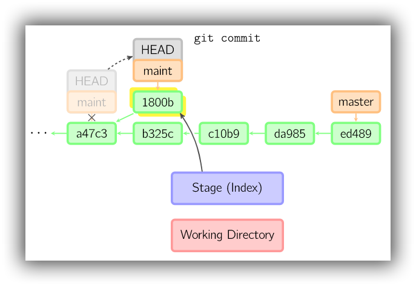
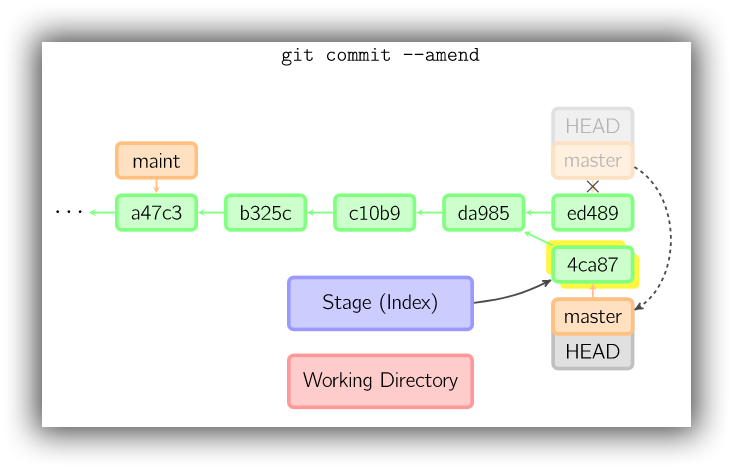
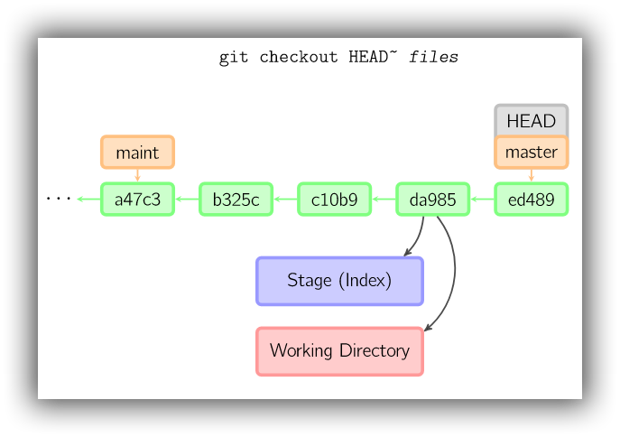
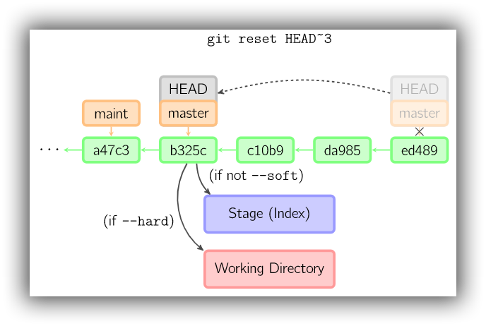
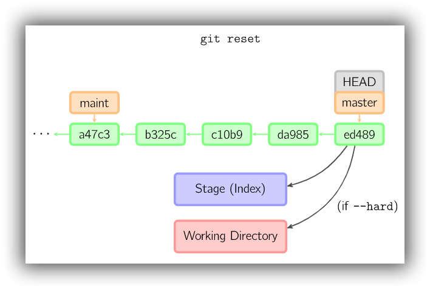
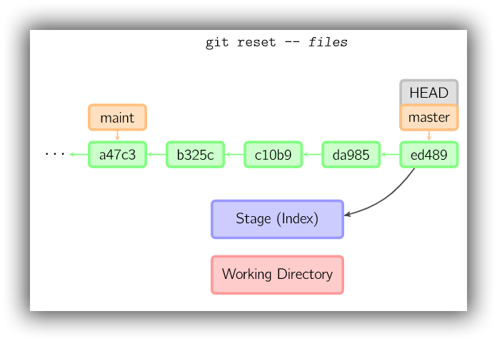

# 基础操作

## 获取与创建仓库

### init

```bash
# 在当前目录新建一个Git代码库
$ git init
# 新建一个目录，将其初始化为Git代码库
$ git init [project-name]
```

### clone

```bash
# 克隆一个项目和它的整个代码历史
$ git clone [url]
# 克隆一个项目和它的整个代码历史，并指定本地仓库的名称
$ git clone [url] [project-name]
```

## 添加和删除

### add

将内容从工作目录添加到暂存区(又称索引区)，以备下次提交。

```bash
Workspace__>Repository

# 添加指定文件到暂存区
$ git add [file1] [file2] ...

# 添加指定目录到暂存区，递归跟踪该目录下的文件
$ git add [dir]
# 添加当前目录的所有tracked和untracked文件的更改
$ git add .

# 添加所有tracked和untracked文件的更改
$ git add -A

# 交互添加模式，添加每个变化前，都会要求确认
# 对于同一个文件的多处变化，可以实现分次提交
$ git add -p

# 添加指定文件到暂存区，忽略.gitignore中的规则
$ git add -f <path> ...
```

### rm

被删除的文件可以从仓库中还原到最近 commit 的版本。`git rm`  可直接删除文件，如果直接通过文件管理器删除文件，也需要通过 `git rm`  更新暂存区。

```bash
# 删除暂存区指定对象，同时删除工作区指定对象
$ git rm <path> ...

# 删除暂存区指定对象，在工作区中继续保留该对象。
$ git rm --cached <path> ...
```

### mv

```bash
# 改名文件，并且将这个改名放入暂存区
$ git mv [file-original] [file-renamed]
```

## 提交

### 暂存>仓库

在没有添加 `-a` 、` [<file>…]` 等参数情况下，会为暂存区生成快照，并将此快照提交到仓库区。

```bash
Stage__>Repository

# 提交暂存区到仓库区，message表示有关本次提交的说明信息
$ git commit -m <msg>
# 提交时显示所有diff信息
$ git commit -v
# 交互提交模式
$ git commit -p

# 使用一次新commit，替代上一次的commit
# 如果代码没有任何新变化，则用来改写上一次commit的提交信息
$ git commit --amend [-m <msg>]
```

commit 时，git 用暂存区的文件创建一个新的 commit 对象，并把当前 commit 设置为父 commit，然后将当前分支指向新的 commit。在下图中，当前分支是 master。在运行命令之前，master 指向 ed489。运行命令后会创建 f0cec，此时 ed489 成为 f0cec 的 parent，最后 master 会指向新的 commit。




即便当前分支是 master 的祖父节点，git 也会执行同样的操作。下图中，对 maint 分支进行 commit，便会生成 1800b。从此时开始，maint 分支便不再是 master 的祖父节点。如要将这两个分支合并，就必须使用  [merge](http://marklodato.github.io/visual-git-guide/index-en.html#merge) (或 [rebase](http://marklodato.github.io/visual-git-guide/index-en.html#rebase)) 。



如果进行了错误的提交，可使用 `git commit --amend` 纠正。调用该命令后，git 会创建一个新的 commit，并用它替换掉之前的 commit。如果旧的 commit 不存在别的引用，便会被丢弃。



### 工作区>暂存和仓库

在添加 `-a` 、` [<file>…]` 等参数后，会先将工作区的内容添加到暂存区，然后为暂存区生成快照，并将此快照提交到仓库区。

```bash
Workspace__>Repository
        |__>Stage

# 提交工作区的指定文件到仓库区和暂存区
$ git commit <file> <file>... [-m <msg>]
# 提交工作区自上次commit之后的变化，到仓库区和暂存区
$ git commit -a [-m <msg>]
$ git commit . [-m <msg>]
# 提交时显示所有diff信息
$ git commit -a -v
# 交互提交模式
$ git commit -a -p

# 使用一次新commit，替代上一次的commit
# 如果代码没有任何新变化，则用来改写上一次commit的提交信息
# 同时，提交工作区的指定文件到仓库区和暂存区
$ git commit --amend <file> <file>... [-m <msg>]
# 或同时，提交工作区自上次commit之后的变化，到仓库区和暂存区
$ git commit -a --amend [-m <msg>]
```

### 提交 Detached HEAD

当 HEAD 处于 `detached HEAD` 状态时，提交操作可以正常进行，唯一不同的是会更新一个未命名的分支——可以把该分支视作匿名分支。


一旦切换到了别的分支(比如，master)，2eecb (可能)就再也不会被引用，并会被丢弃。注意，下图中当切换回 `master` 后，2eecb 便失去了所有引用。


但是，如果想要保存该状态，可以创建一个新的分支来引用 2eecb——使用 `git checkout -b *name*` 命令。


## 撤销

### checkout

#### 从暂存回退工作区

```bash
Stage__>Workspace

# 恢复暂存区的指定文件到工作区
$ git checkout [-p] -- [files]
# 恢复暂存区的所有文件到工作区
$ git checkout [-p] -- .

# [-p] 交互模式 
```

#### 从仓库回退暂存和工作区

```bash
Repository__>Stage
         |__>Workspace

# 恢复某个commit中的指定文件到暂存区和工作区
$ git checkout <commit> [-p] -- [file]
# 恢复最近一个commit中的指定文件到暂存区和工作区
$ git checkout HEAD [-p] -- [file]

# [-p] 交互模式 
# 如果没有给定commit，将从暂存区拷贝文件到工作区
```



#### 补充

关于 `--` 的说明：

```bash
$ git checkout [file]
$ git checkout -- [file]
```

以上两条命令在 `[file]` 没有歧义的情况下，都表示恢复暂存区的指定文件到工作区。但是如果存在歧义，则会优先处理分支切换。具体如下：

> When there is only one argument given and it is not -- (e.g. "git checkout abc"), and when the argument is both a valid `<tree-ish>` (e.g. a branch "abc" exists) and a valid `<pathspec>` (e.g. a file or a directory whose name is "abc" exists), Git would usually ask you to disambiguate. Because checking out a branch is so common an operation, however, "git checkout abc" takes "abc" as a `<tree-ish>` in such a situation. Use git checkout -- `<pathspec>` if you want to checkout these paths out of the index.

`--` 在内置命令和许多其它命令，用于表示命令选项的结束，在 `--` 之后只接受位置参数。Git 的一些命令中，借鉴了这种用法，使用 `--` 去隔离开“树”与“路径”。

### reset



#### 从仓库回退暂存

如果没有指定 commit，则会默认使用 HEAD。

```bash
Repository__>Stage

# 重置暂存区，所有文件与上一次commit保持一致，但工作区不变
$ git reset

# 重置暂存区的指定文件，与上一次commit中对应保持一致，但工作区不变
$ git reset -- [files]

# [-p] 交互模式 
```





#### 回退仓库并覆盖暂存

```bash
Repository__>Stage
# 重置当前分支的指针为指定commit，同时重置暂存区，但工作区不变
$ git reset [commit]

# 重置暂存区的指定文件，与指定commit中对应文件保持一致，但工作区不变
$ git reset [commit] -- [files]
```


#### 回退仓库并覆盖暂存和工作区

```bash
Repository__>Stage
         |__>Workspace
         
# 重置暂存区与工作区，与上一次commit保持一致
$ git reset --hard

# 重置当前分支的指针为指定commit，同时重置暂存区和工作区
$ git reset --hard  [<commit>]
```

#### 仅回退仓库

```bash
Repository

# 重置当前分支的指针为指定commit，但保持暂存区和工作区不变
$ git reset --soft [commit]
```

### revert

```bash
# 新建一个commit，用来撤销指定commit
# 后者的所有变化都将被前者抵消，并且应用到当前分支
$ git revert [commit]
```

`revert` 命令本质上就是一个逆向的 `cherry-pick` 操作。 它将你提交中的变更的以完全相反的方式的应用到一个新创建的提交中，本质上就是撤销或者倒转。 

## 储藏 

### stash

工作区和暂存区是一个公开的工作台，任何分支都会用到，并能看到工作台上最新的内容，只要在工作区、暂存区的改动未能够提交到某一个版本库（分支）中，那么在任何一个分支下都可以看得到这个工作区、暂存区的最新实时改动。
`stash` 用于将暂存区的修改藏匿起来，使整个工作台看起来都是干净的。所以要清理整个工作台，那么前提是必须先将工作区的内容都 `add` 到暂存区中去。之后在干净的工作台上可以做另外一件紧急事件与藏匿起来的内容是完全独立的。另外：没有被暂存的文件，是无法被 `stash` 的。

```bash
# 存储当前分支中未commit的变换，并清理工作空间和暂存区
$ git stash

# 恢复工作空间和暂存区，但不删除相应stash
$ git stash apply stash@{0}

# 删除指定stash
$ git stash drop stash@{0}

# 恢复工作空间和暂存区，并删除相应stash
$ git stash pop

# 查看stash列表
$ git stash list
```

## 归档

### archive

```bash
# 生成一个可供发布的压缩包
$ git archive
```


