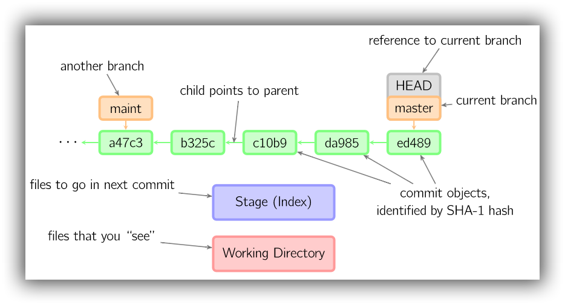

# 术语

[TOC]

- **Workspace**：工作区
- **Index / Stage**：暂存区，工作区和暂存区是一个公开的工作台，任何分支都会用到，并能看到工作台上最新的内容，只要在工作区、暂存区的改动未能够提交到某一个版本库（分支）中，那么在任何一个分支下都可以看得到这个工作区、暂存区的最新实时改动。
- **Repository**：仓库区(本地仓库/版本库)，工作区中的 `.git` 目录。仓库区中包含了暂存区，以及 Git 自动创建的 master 分支，还有指向 master 的 HEAD 指针。

- **Remote**：远程仓库
- **origin**：指向当前远程仓库的指针，Git 默认的名称。
- **master**：当前主分支
- **HEAD**：指向当前分支的指针。如果当前分支是 master ，HEAD 便是指向 master 的指针，master 再指向最近一次 commit。如果当前分支是 dev，HEAD 便是指向 dev 的指针，dev 会指向最近一次 commit。假设当前分支是 master，`master`、`master~` 和 `master~2` 会分别指向三个最近的 commits，同时 `HEAD`、`HEAD^` 和 `HEAD~2` 又会依次指向 `master`、`master~` 和 `master~2` 。当命令中需要使用 commit_id 时，也可直接使用 `master~` 或 `HEAD^` 等与 commit_id 存在引用关系的指针。另外在重设 commit 时，Git 会自动调整 `master` 所引用的 commit。

- **commit**：该对象通过 SHA-1 hash 标识，比如下图中绿色框内 5 位字符的 ID，并通过箭头指向其 parent。图中给出了最新的5个commit。
- **branch**：分支，在下图中以橙色方框表示，并指向特定的 commit。当前分支由由特定引用 HEAD 标识，并附着于当前分支上方。ed489 表示最近的commit，当前分支 master 指向该 commit。

- **patch**：Git 中的一些命令是以引入的变更，即 commit 这样的概念为中心的。这样一系列的 commit，表示一系列的补丁。比如 cherry-pick、git rebase、git revert。

