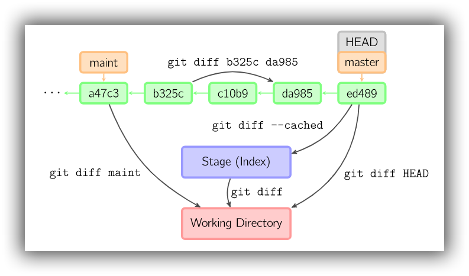

# 检查与比较

## status

```bash
# 显示有变更的文件(针对工作空间中的文件)
$ git status
# 状态简览
$ git status -s
```

## log

```bash
# 显示当前分支的版本历史
$ git log
# 显示最近一条提交
$ git log -1

# 显示commit历史，以及每次commit发生变更的文件
$ git log --stat

# 显示当前分支的简略commit日志
$ git log --pretty=oneline
# 显示过去5次提交
$ git log -5 --pretty=oneline
# 显示当前分支的简略commit日志，同时缩写commit_ID
# "--pretty=oneline --abbrev-commit"的缩写
$ git log --oneline

# 显示某个commit之后的所有变动，每个commit占据一行
$ git log [tag] HEAD --pretty=format:%s

# 显示某个commit之后的所有变动，其"提交说明"必须符合搜索条件
$ git log [tag] HEAD --grep feature

# 显示某个文件的版本历史，包括文件改名
$ git log --follow [file]
$ git whatchanged [file]

# 显示指定文件相关的每一次diff
$ git log -p [file]

# 搜索提交历史，根据关键词
$ git log -S [keyword]

# 查看当前分支合并情况
$ git log --graph --pretty=oneline --abbrev-commit
# 查看各个分支之间的关系图
# --decorate 标记会让git log显示每个commit的引用(如:分支、tag等) 
# --simplify-by-decoration 只显示被branch或tag引用的commit
# --all 表示显示所有的branch，这里也可以选择，比如我指向显示分支ABC的关系，则将--all替换为branchA branchB branchC
$ git log --graph --decorate --oneline --simplify-by-decoration --all
# 查看各个分支之间的关系图，使用gitk
gitk --simplify-by-decoration --all
```

 参考：[git查看各个branch之间的关系图](https://blog.csdn.net/fickyou/article/details/52584161)

## shortlog

git shortlog 是一个用来归纳 git log 的输出的命令。 它可以接受很多与 git log 相同的选项，但是此命令并不会列出所有的提交，而是展示一个根据作者分组的提交记录的概括性信息 

```bash
# 显示所有提交过的用户，按提交次数排序
$ git shortlog -sn
```

## blame

```bash
# 显示指定文件是什么人在什么时间修改过
$ git blame [file]
```

## show

```bash
# 显示某次提交的元数据和内容变化
$ git show [commit]

# 显示某次提交发生变化的文件
$ git show --name-only [commit]

# 显示某次提交时，某个文件的内容
$ git show [commit]:[filename]
```

## relog

```bash
# 显示对当前分支的已执行过的命令，开头的数组表示相应版本的commit_id
$ git reflog
```

## check-ignore

```bash
# 查看pathname是否被.gitignore忽略，并输出详细信息
$ git check-ignore -v App.class
.gitignore:3:*.class    App.class
```

## diff



```bash
# 显示工作区和暂存区的差异
$ git diff

# 显示工作区与当前分支最新commit之间的差异
$ git diff HEAD [--] [<path>…]
# 显示工作区与指定commit间的差异
$ git diff [<commit>|<branch_name>] [--] [<path>…]

# 显示暂存区和上一个commit的差异
$ git diff --cached [--] [<path>…]
# 显示暂存区和指定commit的差异
$ git diff --cached [<commit>] [--] [<path>…]

# 显示两次提交之间的差异
$ git diff <commit> <commit> [--] [<path>…]

# 显示今天你写了多少行代码
$ git diff --shortstat "@{0 day ago}"
```

